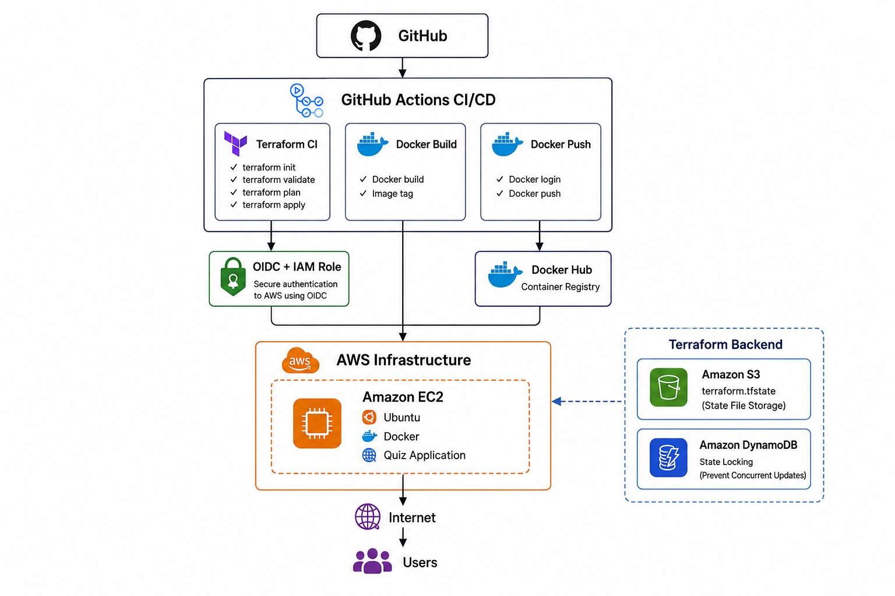
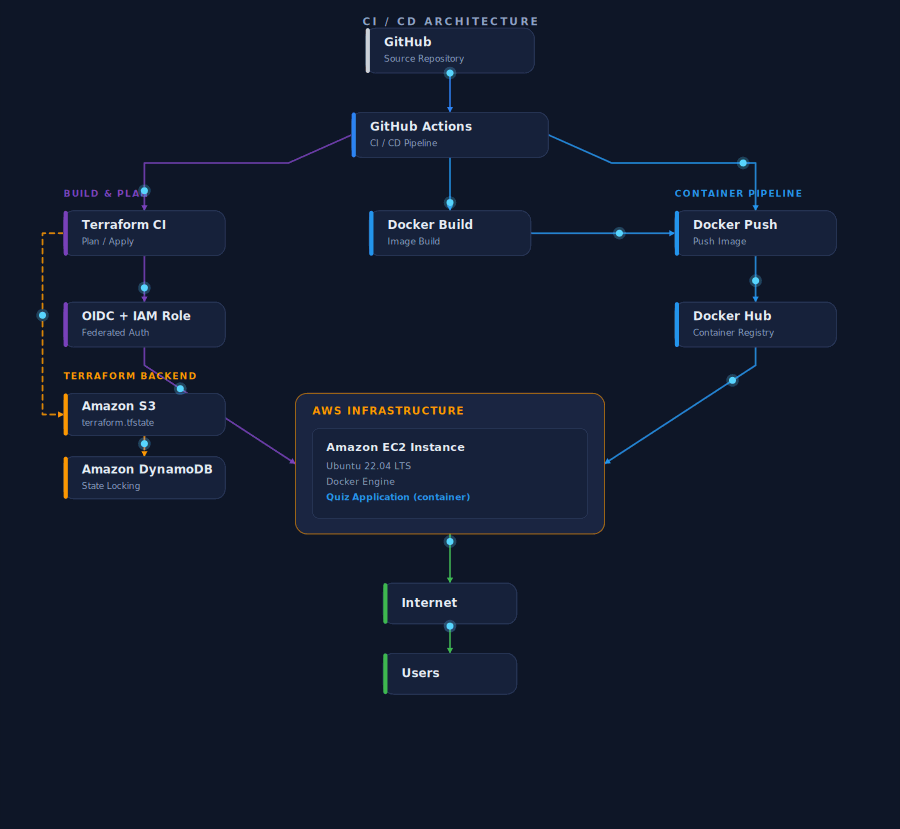
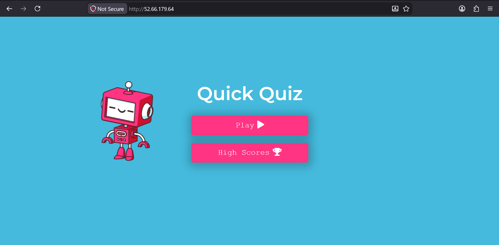
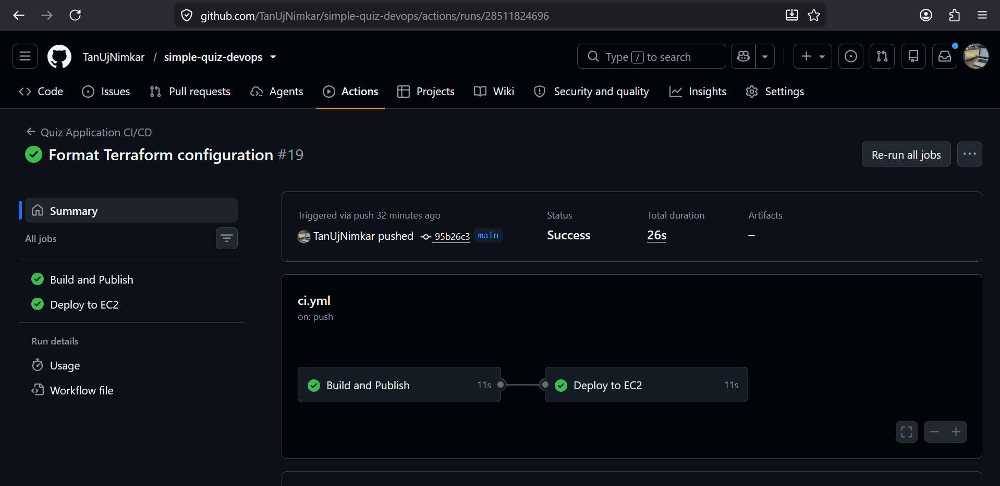
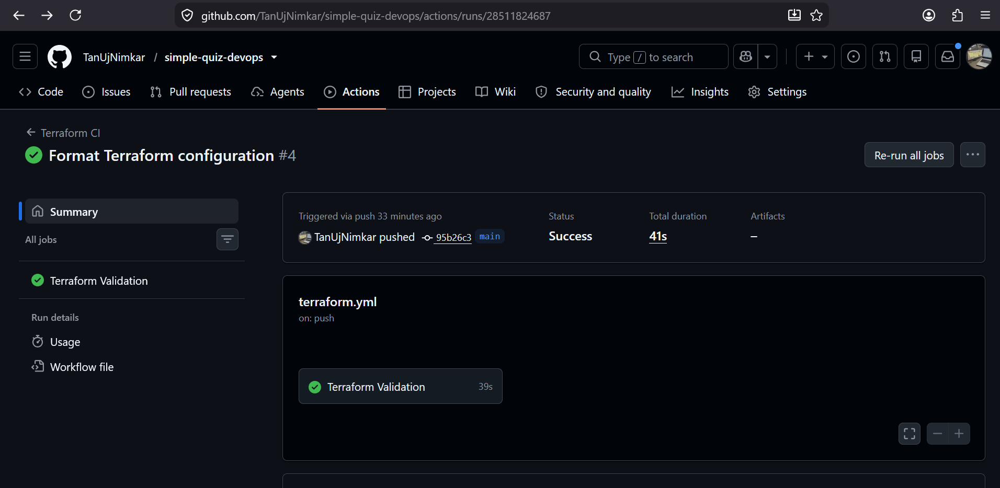
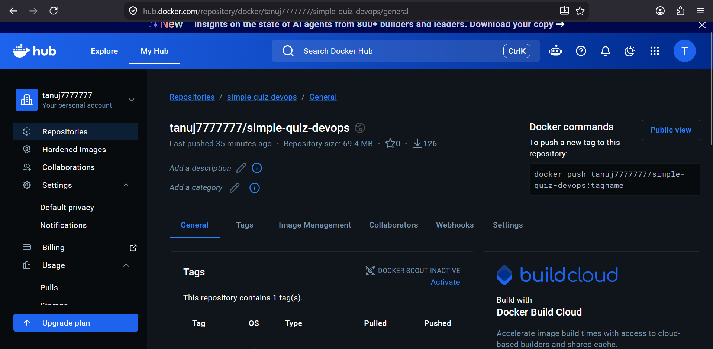
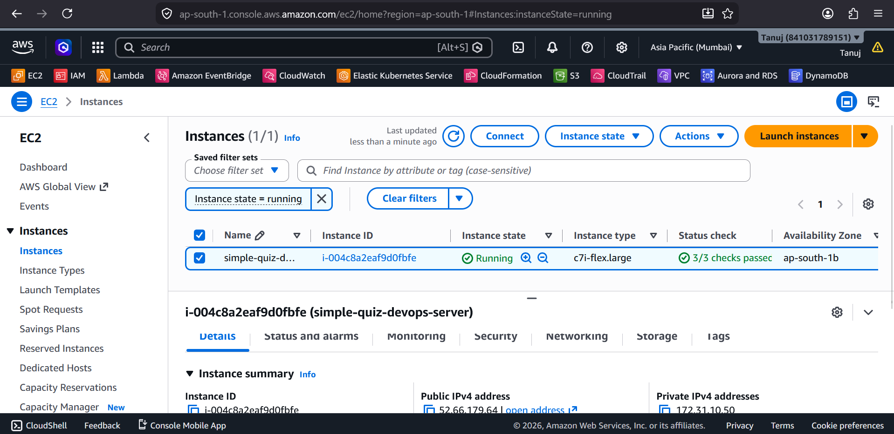
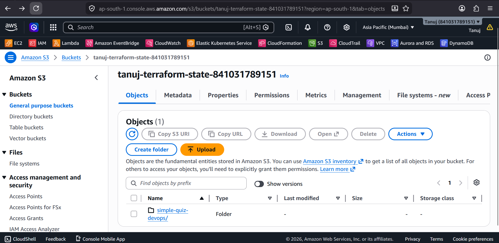
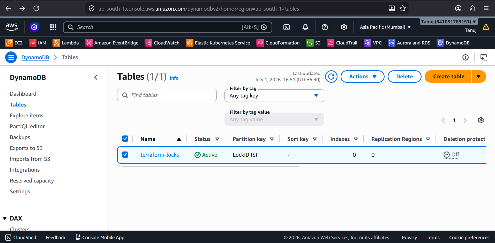
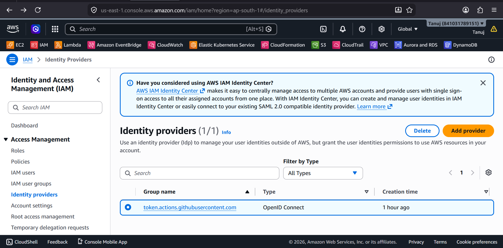

# 🚀 Simple Quiz DevOps Platform

A production-style DevOps project that demonstrates the complete CI/CD lifecycle using GitHub Actions, Docker, Terraform, AWS, and modern authentication with GitHub OIDC.

---

# 📌 Project Overview

This project automates the deployment of a Dockerized Quiz Application to AWS EC2 using GitHub Actions.

The infrastructure is provisioned with Terraform, Terraform state is stored remotely in Amazon S3, state locking is handled by DynamoDB, and GitHub OIDC is used for secure authentication without long-lived AWS access keys.

---

# 🏗️ Architecture



---

# 🎬 CI/CD Pipeline Demo



---

# ⚡ Features

- ✅ GitHub Actions CI/CD
- ✅ Dockerized Application
- ✅ Docker Hub Integration
- ✅ Automated EC2 Deployment
- ✅ Infrastructure as Code using Terraform
- ✅ Remote Terraform State (Amazon S3)
- ✅ Terraform State Locking (DynamoDB)
- ✅ Elastic IP Management
- ✅ GitHub OIDC Authentication
- ✅ Terraform Validation Pipeline
- ✅ Automated Docker Deployment
- ✅ Ubuntu EC2 Hosting

---

# 🛠️ Technology Stack

### Version Control

- Git
- GitHub

### CI/CD

- GitHub Actions

### Containerization

- Docker
- Docker Hub

### Infrastructure as Code

- Terraform

### Cloud

- AWS EC2
- Amazon S3
- Amazon DynamoDB
- IAM
- GitHub OIDC

### Operating System

- Ubuntu Server

---

# 📂 Project Structure

```text
simple-quiz-devops
│
├── .github
│   └── workflows
│       ├── ci.yml
│       └── terraform.yml
│
├── terraform
│   ├── backend.tf
│   ├── provider.tf
│   ├── versions.tf
│   ├── variables.tf
│   ├── outputs.tf
│   ├── data.tf
│   ├── ec2.tf
│   ├── elastic-ip.tf
│   ├── modules
│   └── scripts
│
├── docs
│   ├── architecture.png
│   ├── pipeline-demo.gif
│   └── screenshots
│
├── Dockerfile
└── README.md
```

---

# 🔄 CI/CD Workflow

```text
Developer
      │
      ▼
Git Push
      │
      ▼
GitHub Repository
      │
      ▼
GitHub Actions
      │
      ├── Terraform Validation
      ├── Build Docker Image
      ├── Push Docker Image
      └── Deploy to EC2
               │
               ▼
          Docker Hub
               │
               ▼
           AWS EC2
               │
               ▼
        Quiz Application
```

---

# ☁️ Infrastructure

Terraform provisions and manages:

- Amazon EC2
- Security Group
- Elastic IP
- Amazon S3 Remote Backend
- DynamoDB State Locking

---

# 🔐 Security

This project uses modern authentication and Infrastructure as Code practices.

Implemented:

- ✅ GitHub OIDC Authentication
- ✅ IAM Role Authentication
- ✅ Remote Terraform State
- ✅ State Locking
- ✅ Docker Secrets
- ✅ GitHub Secrets

---

# 📸 Screenshots

## Application



---

## GitHub Actions CI/CD



---

## Terraform Validation



---

## Docker Hub



---

## EC2 Instance



---

## Amazon S3 Backend



---

## DynamoDB State Locking



---

## GitHub OIDC Authentication



---

# 🚀 Deployment Flow

```text
Git Push
      │
      ▼
GitHub Actions
      │
      ▼
Build Docker Image
      │
      ▼
Push to Docker Hub
      │
      ▼
SSH Deployment
      │
      ▼
AWS EC2
      │
      ▼
Docker Container
      │
      ▼
Quiz Application
```

---

# ✅ Completed Milestones

- Git & GitHub
- GitHub Actions CI/CD
- Docker
- Docker Hub
- AWS EC2
- Terraform
- Remote Backend (S3)
- DynamoDB Locking
- Elastic IP
- Terraform Modules
- GitHub OIDC Authentication
- Automated Deployment

---

# 🔮 Future Improvements

- SonarQube Integration
- Trivy Security Scanning
- Kubernetes (Amazon EKS)
- Helm Charts
- Argo CD (GitOps)
- Prometheus Monitoring
- Grafana Dashboards
- Loki Logging
- Alertmanager

---

---

# 🙏 Acknowledgements

This project is built on top of the original Simple Quiz application.

Original Repository:
https://github.com/RupamG/simple-quiz

Original Live Demo:
https://quick-quiz-app.netlify.app/

Special thanks to the original contributors:

- **Rupam Gogoi** ([@RupamG](https://github.com/RupamG)) for creating the original Quiz Application.
- **Dav.O.** ([@DavOlufuwa](https://github.com/DavOlufuwa)) for contributing to the original project.

This repository extends the original application with a complete DevOps implementation, including:

- ✅ GitHub Actions CI/CD
- ✅ Docker & Docker Hub
- ✅ Terraform Infrastructure as Code
- ✅ AWS EC2 Deployment
- ✅ Amazon S3 Remote Terraform State
- ✅ DynamoDB State Locking
- ✅ GitHub OIDC Authentication
- ✅ Elastic IP Management
- ✅ Automated Infrastructure Validation
- ✅ Automated Application Deployment

The DevOps architecture, infrastructure automation, CI/CD pipelines, cloud deployment, and documentation in this repository were implemented independently as part of this learning and portfolio project.

---


# 👨‍💻 Author

**Tanuj Nimkar**

GitHub: https://github.com/TanUjNimkar

LinkedIn: www.linkedin.com/in/tanuj-nimkar

Email: tanujnimkar.cloud@gmail.com